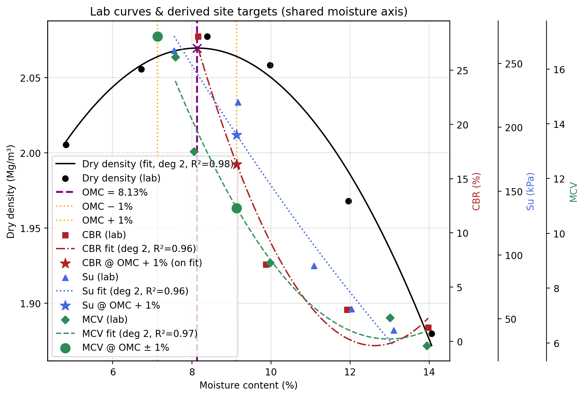

# GeoSpec-Automator
 

Automates the Earthworks lab → specification step from a single Excel file (Dry Density, CBR, Su, MCV).  
Generates a combined plot and a one-page PDF summary with OMC, MDD, and site target parameters.

**Goal:** reduce manual work and make the lab → spec process traceable and reproducible.

## Why it matters
Earthworks design often relies on manual lab data and inconsistent formats. This tool streamlines QA/QC, minimises transcription errors, and keeps a transparent data trail—ready for digital delivery and BIM (Building Information Modelling)–integrated workflows.


## What it does
- Validates the input Excel (sheet names and required columns)
- Performs basic QA/QC: flags out-of-range values and drops blanks
- Fits the compaction curve to obtain **OMC** and **MDD**
- Derives key site targets:
  - ≥ 95% MDD
  - CBR & Su at **OMC + 1%**
  - MCV range at **OMC ± 1%**
- Exports a high-quality plot and a concise PDF summary for inclusion in reports

> Engineer’s specification always governs. Values are derived from supplied lab data.


## Input (Excel)
A single workbook with the following sheets (case-sensitive):

| Sheet        | Columns                     | Units       |
|---------------|-----------------------------|-------------|
| DryDensity    | `Moisture`, `DryDensity`    | (%) , (Mg/m³) |
| CBR           | `Moisture`, `CBR`           | (%)          |
| Su            | `Moisture`, `Su`            | (kPa)        |
| MCV           | `Moisture`, `MCV`           | (index)      |


## Installation
Tested with Python 3.13 (compatible with 3.11+)

> In Anaconda Prompt, first navigate to your project folder (`cd path/to/project`), then run:

```bash
conda create -n ew python=3.13 -y
conda activate ew
pip install -r requirements.txt
```

## Usage
```bash
python earthworks_automation.py lab_data_earthworks.xlsx --outdir outputs
```
If `--outdir` is omitted, outputs are saved to `outputs/`.


## Outputs
`outputs/lab_curves.png` — combined moisture content axis plot (Dry Density, CBR, Su, MCV)

`outputs/spec_summary_YYYYMMDD_HHMM.pdf` — one-page summary with derived site targets

<p align="center">  </p>

## Notes & Limits
Uses polynomial fits; no outlier removal

Warns if OMC + 1% lies outside the lab moisture range (extrapolation)

Intended as a digital helper tool — final project specifications take precedence

## Author
Pooneh Shah Malekpoor, PhD (Geotechnical Engineering)
KTP Associate · Leeds Beckett University × Borehole Solutions
Focused on data-driven geotechnical design and automation.

## License
Licensed under the [MIT License](LICENSE)


